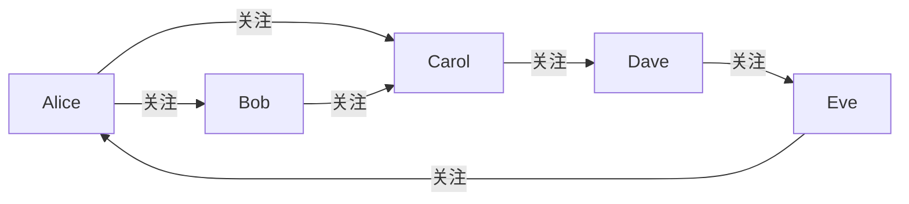
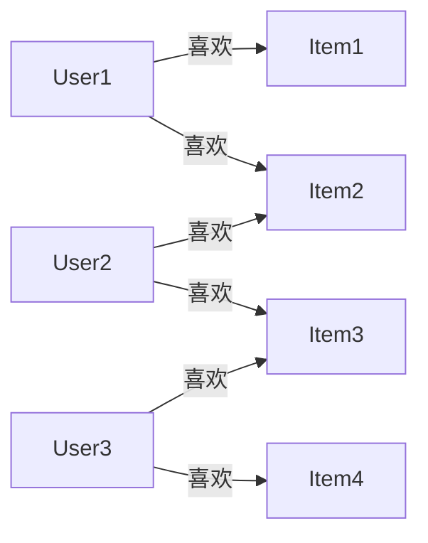
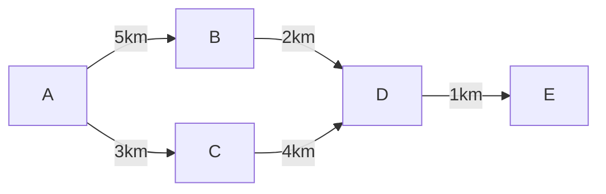

# 图论在AI学习中的应用

图论是数学的一个分支，它研究由节点（或称为顶点）和连接这些节点的边（或称为弧）组成的图的性质。在人工智能（AI）的学习中，图论扮演着重要的角色，因为它提供了一种强大的工具来表示和处理复杂的关系和结构。

## 理论知识

### 图的基本概念

- **节点（Node）**：图中的基本单位，可以代表任何实体，如人、地点、物品等。
- **边（Edge）**：连接两个节点的线，表示节点之间的关系或交互。
- **有向图（Directed Graph）**：边有方向的图，表示关系是单向的。
- **无向图（Undirected Graph）**：边没有方向的图，表示关系是双向的。
- **权重（Weight）**：边可以有权重，表示关系的强度或成本。

### 图论算法

- **最短路径算法**：如Dijkstra算法和Floyd-Warshall算法，用于找到图中两个节点之间的最短路径。
- **最小生成树算法**：如Prim算法和Kruskal算法，用于找到连接所有节点的最小成本子图。
- **图的遍历算法**：如深度优先搜索（DFS）和广度优先搜索（BFS），用于探索图中的所有节点。

## 应用案例

### 社交网络分析

在社交网络中，每个用户可以被视为一个节点，而用户之间的关注、好友关系可以被视为边。通过图论，我们可以分析社交网络的结构，如找到关键的影响者（度数高的节点），或者分析社区结构（紧密连接的节点群）。

```markdown
# 社交网络图示例



在这个图中，我们可以看到Alice、Bob、Carol形成了一个小团体，而Dave和Eve是另一个小团体。通过分析这样的图，我们可以了解社交网络的动态和影响力传播。

### 推荐系统

在推荐系统中，图论可以用来构建用户-物品图，其中用户和物品都是节点，用户对物品的评价或购买行为是边。通过分析这种图，推荐系统可以发现用户可能感兴趣的物品，方法是找到与用户已评价物品相似的其他物品。

```markdown
# 推荐系统图示例



在这个图中，如果User1访问了系统，推荐系统可能会推荐Item3，因为User2和User3都喜欢的Item3，而User1和User2有共同的喜好（Item2）。

### 路径规划

在自动驾驶或物流规划中，图论用于构建道路网络图，其中节点是交叉口或地点，边是道路，权重可以是距离、时间或成本。通过最短路径算法，可以规划出最优的行驶路线。

```markdown
# 路径规划图示例



在这个图中，如果要从A到E，最短路径是A -> C -> D -> E，总距离是8km。

## 结论

图论在AI学习中的应用广泛，它不仅帮助我们理解和表示复杂的关系网络，还提供了强大的算法来解决实际问题。通过上述案例，我们可以看到图论在社交网络分析、推荐系统和路径规划等领域的实际应用。随着AI技术的发展，图论的应用将会更加深入和多样化。
